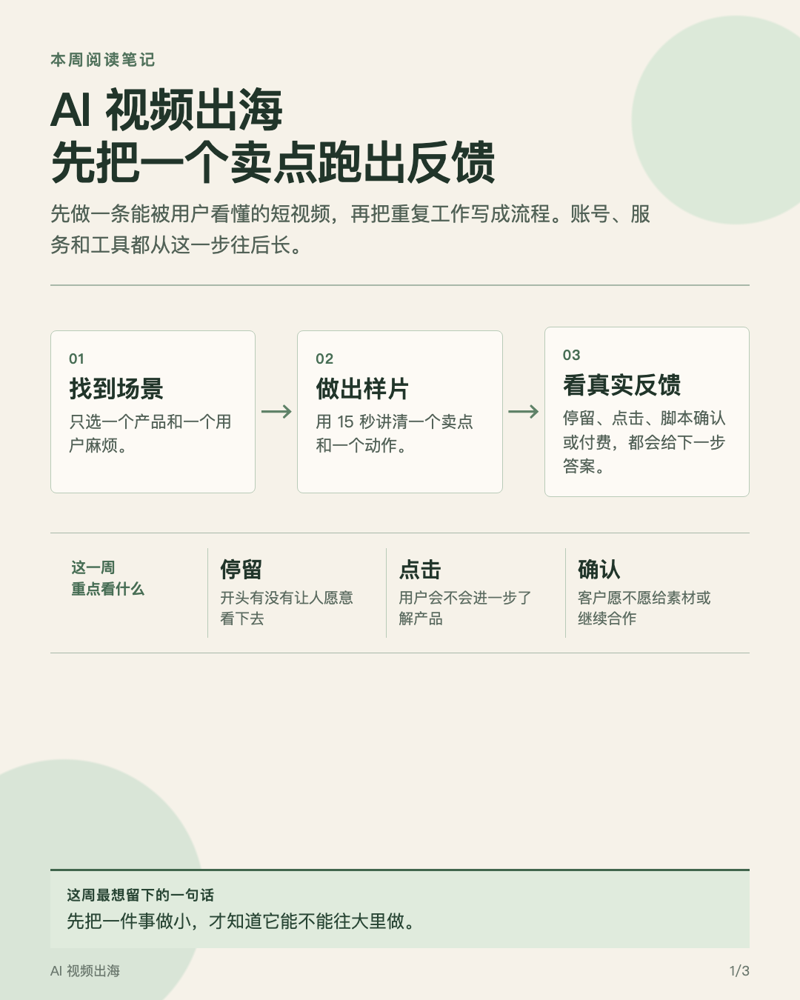

# 生财 MCP 实验室

把生财有术里的风向标、精华帖、日常分享、项目库、航海和深海圈内容，变成可回查的研究、学习计划和分享卡。

它面向已经在 Codex 中使用生财 MCP 的圈友，也能在首次使用时引导完成官方 OAuth 授权。你只需要在浏览器确认授权，Skill 不会要求你复制命令、授权码或回调地址。



## 能做什么

- 整理昨日风向标和每周主题变化，区分信号、课题和行动。
- 筛选精华帖、中标帖和日常分享，保留圈友的做法、结果、代价和原帖链接。
- 拆解单篇帖子、项目案例和圈友动态，判断哪些做法能借，哪些条件不能省。
- 查看已报名航海、深海圈课程和学习进度，把资料变成下一项练习。
- 生成 Markdown 研究母稿、网页简报、PDF 和朋友圈卡组。
- 在用户明确提出时，请 AI 亦仁或 AI 刘小排补充反证与行动建议。

## 安装

将整个 `shengcai-mcp-lab` 文件夹放到以下任一位置。

```text
项目内安装
<你的项目>/.agents/skills/shengcai-mcp-lab/

用户级安装
~/.codex/skills/shengcai-mcp-lab/
```

下载仓库后保留文件夹结构即可。项目级安装适合只在一个项目里使用，用户级安装适合在本机 Codex 的多个项目中复用。

## 第一次使用

在 Codex 里直接说出你要解决的问题，例如：

```text
使用 $shengcai-mcp-lab，帮我找最近 7 天 AI 视频出海值得读的精华帖，生成研究报告和朋友圈卡。
```

如果当前 Codex 还没有生财 MCP，Skill 会在当前运行环境内完成官方连接流程。浏览器授权完成后，按提示重启一次当前 Codex 会话，再继续研究。

单次阅读任务只需要提供主题。持续日报、周报、学习规划或个性化推荐时，再补充方向卡里的目标、时间、能力和交付偏好。

## 常用提问

```text
帮我整理昨日风向标，区分值得行动、继续研究和只观察的内容。

我做 AI 视频出海，最近 7 天有哪些精华帖值得读？请说明圈友怎么做、结果如何、我该带着什么问题读。

帮我拆解这篇帖子，写清作者做法、数据、成本、限制和我能先验证的一步。

查看我报名的航海和深海圈学习进度，帮我安排本周只完成的一项作业。

我想链接做跨境内容服务的圈友，帮我找公开案例并准备一个具体问题。
```

## 交付原则

研究报告保留来源。主推荐会写明圈友、帖子、时间、做法、结果、代价和原帖链接；事实、作者观点与报告判断分开呈现。

朋友圈卡只保留消化后的内容和阅读体会，不展示圈友名、帖子标题、原帖链接或引用标记。卡片适合分享，研究母稿用于回查和继续追问。

单条强信号生成一张卡。多篇阅读默认生成三到五张卡，每张只讲一篇文章或一个主题。

## 完整示例

示例模拟一位刚开始做跨境电商的圈友，询问“AI 视频出海这一周该读什么、该验证什么”。示例数据全部虚构，不包含生财有术的付费内容或真实圈友信息。

- [示例说明](examples/ai-video-overseas-weekly/README.md)
- [研究母稿](examples/ai-video-overseas-weekly/report.md)
- [网页简报](examples/ai-video-overseas-weekly/report.html)
- [朋友圈卡组](examples/ai-video-overseas-weekly/cards.html)

## 前提与边界

- 需要生财账户、可用的 Codex 环境和生财 MCP 服务访问权限。内测阶段可能受白名单限制。
- 所有操作遵循当前账号权限。航海和深海圈只读取你有权访问的内容。
- 点赞、收藏、投锚等社区互动必须由你对具体目标明确确认。
- 当前 MCP 不提供发帖、上传帖子或代替用户发布内容的能力。
- 研究产物写在项目任务目录，不写回 Skill 文件夹。

## 许可

本项目采用 [MIT-0](LICENSE) 许可。
